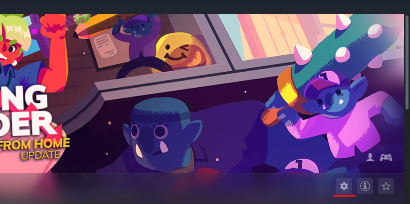
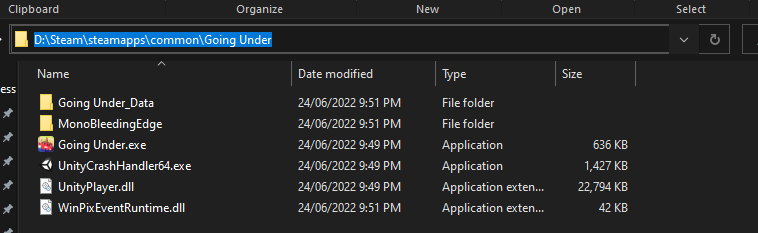

# Cornercutter

Cornercutter is a modding tool for the game [Going Under](https://aggrocrab.com/Going-Under), that allows for complete customisation of skills and items within the dungeons.  

## Finding Your Going Under Installation

Cornercutter will attempt to automatically locate where Going Under is installed by looking in common installation directories, however, if you've not installed it in the default location or it can't be found for any reason, you will need to manually locate this directory for Cornercutter.

### Steam Version

You can find the directory where Going Under is installed by opening up Steam and clicking on the cog located on the right just under the banner. (Underlined in red below).

If you then click on Manage > Browse local files, this will bring you to the folder where Going Under is installed. All you then need to do now is copy and paste this directory into the text field in Cornercutter when prompted.

## Development

### Prerequisites 

This web application uses Tauri. Follow their instructions [here](https://tauri.app/v1/guides/getting-started/prerequisites) to make sure you have all the required prerequisites.

### Setup

1. Make sure to install all the dependencies by doing `npm install` in the root folder.
2. Install the Prettier extension for your IDE of choice.
   - [VSCode](https://marketplace.visualstudio.com/items?itemName=esbenp.prettier-vscode)

### Running Cornercutter

- `npm run client` - A development option that starts the application with hotswapping. **Note:** This is equivalent to `npm run tauri dev`.
  
- `npm run tauri build` - Builds an optimised version of the application in `src-tauri/target/release/`.

